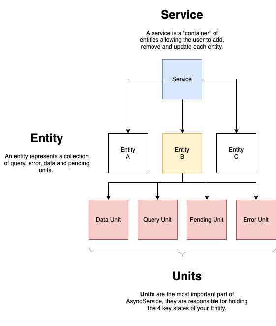

# Activite

[](https://opensource.org/licenses/Apache-2.0)
[](https://gitlab.aws.dev/aws-apj-anz/AsyncService/-/blob/master/LICENSE)
[](https://gitlab.aws.dev/aws-apj-anz/AsyncService/-/commits/master)


## Background

Modern web application development requires a modern framework for the management of state, async calls, errors and pending states. Be it React, Angular or native node.js applications, this library aims to provide the developer a reactive, declarative and fluent interface for state management.

Leveraging the amazing [Active.js](https://activejs.dev/#/) library, AsyncService builds in ....
## Quick Example

### Node / Stand-alone

```javascript
import { AsyncApi, DynamoReturn } from 'activite'
import { mergeMap, map } from 'rxjs/operators';
import { from, Observable, of } from 'rxjs'

/** data elements are a simple object */
interface myUserItem {
    product: string
    discount: number
    cost: number
    discountedPrice?: number
}

/** define a simple interface for our data */
interface myServiceData<T> extends DynamoReturn {
    Items: T[];
}

/** create a service and  pass in some connection details 
 * you can have as many of these as you want 
*/
const myUserService: AsyncApi = new AsyncApi({ baseUrl: 'http://localhost', port: 3000 })

/** tell the service about our data types and give it a name 
 * this is called a service entity. you can have as many of these as you like - provided
 * they are uniquely named
*/
myUserService.add<myServiceData<myUserItem>>("myUserData")

/** get the query, pending, data and error values from the entity */
const { query: userDataQuery, pending: userDataPending, data: userData, error: UserDataError } = myUserService.entity("myUserData");

/** we can subscribe to the error */
UserDataError.future$.subscribe((error: any) => {
    console.log(error)
})

/** we can subscribe to the pending state */
userDataPending.future$.subscribe((pending: boolean) => {
    console.log(pending ? 'pending' : 'not pending')
})

/** helper function to calculate the discounted price */
const generateDiscount = (item: Observable<myUserItem>): Observable<any> =>
    from(item).pipe(map(item => ({ ...item, discountedPrice: item.cost * (1 - (item.discount / 100)) })))

/** we can also use rxjs to manipulate the stream of return data */
userData.future$.pipe(
    mergeMap((item: Observable<myUserItem>) => generateDiscount(item))
).subscribe((d: myUserItem) => console.log(d))

/** dispatch our query */
userDataQuery.dispatch({
    path: 'data'
})
```


### React App
## Fundamentals



## API

## Contributing
See 
